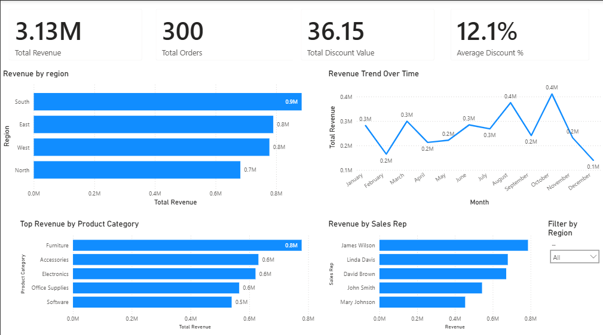

# 📊 Sales Performance Dashboard
End-to-End Data Analytics Project: Python → PostgreSQL → AWS → Power BI
This project demonstrates an **end-to-end Data Analytics pipeline** using Python, SQL, cloud infrastructure, and Power BI.

The goal of the project is to analyze sales performance across **regions, products, and sales representatives** and present actionable insights through an **interactive dashboard**.

---

# 🛠️ Technologies Used

* Python (pandas) – Data cleaning and transformation
* Google Colab – Cloud environment for the ETL pipeline
* PostgreSQL (Supabase) – Cloud database and SQL transformations
* AWS EC2 – Cloud-based Windows virtual machine to run Power BI
* Power BI – Data visualization and dashboard creation
* Excel – Raw source data

---

# ☁️ Cloud Architecture

Because Power BI Desktop only runs on Windows, the dashboard was developed using a **Windows virtual machine hosted in AWS**.

### Data Pipeline Architecture

```
Excel (Raw Data)
      ↓
Python ETL (Google Colab)
      ↓
Cleaned CSV Dataset
      ↓
PostgreSQL Database (Supabase)
      ↓
AWS EC2 Windows Virtual Machine
      ↓
Power BI Dashboard
```

This setup demonstrates how a **modern cloud-based analytics workflow** can be built without requiring a local Windows environment.

---

# 🔄 Data Processing (ETL Pipeline)

Data cleaning and transformation were performed using **Python (pandas) in Google Colab**.
The ETL pipeline prepares the raw dataset for analysis and visualization.

### ETL Steps

**Extract**

* Load raw Excel sales data

**Transform**

* Remove null values
* Standardize region names
* Convert `order_date` to datetime format
* Calculate **Net Revenue (Revenue – Discount)**
* Extract **Month and Year**
* Compute **Margin %**

**Load**

* Export cleaned dataset to **CSV** for use in Power BI and PostgreSQL.

---

# 🗄️ SQL Transformations

SQL transformations were implemented in **PostgreSQL (Supabase)** to support analytical queries.

Example analyses include:

* Revenue by Region
* Monthly Sales Trends
* Top Sales Representatives

The full SQL implementation can be found in:

```
sql/transformations.sql
```

---

# 📊 Power BI Dashboard

An interactive **Power BI dashboard** was created to visualize key sales insights.

### Key Metrics

* Total Revenue
* Total Orders
* Total Discount Value
* Average Discount %

### Visualizations

* Revenue Trend by Month
* Revenue by Region
* Top Revenue by Product
* Sales Performance by Sales Representative
* Interactive Region Filter

---

# 🖼️ Dashboard Preview



---

# 📁 Project Structure

```
sales-performance-dashboard
│
├── raw_sales_data.xlsx
├── sales_data_postgres_ready.csv
├── sales_etl_pipeline.ipynb
├── transformations.sql
├── sales-performance-dashboard.pbix
├── sales-dashboard.png  
└── README.md
```

---

# 🚀 Project Summary

In this project I:

* Built a **cloud-based ETL pipeline using Python**
* Implemented **data cleaning and transformation using pandas**
* Stored and transformed data in **PostgreSQL (Supabase)**
* Created **SQL analytical queries**
* Developed an **interactive Power BI dashboard**
* Used **AWS EC2 to run Power BI Desktop in a cloud Windows environment**

This project demonstrates a **complete data analytics workflow from raw data to business insights**.
